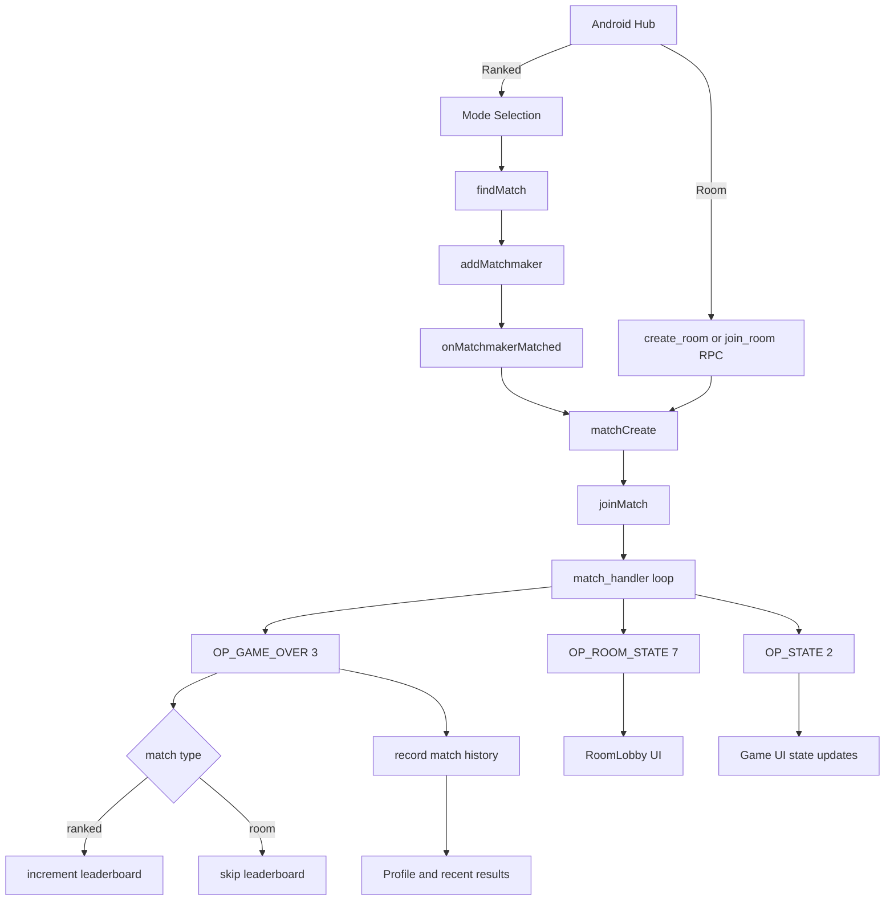

# TicTacToe Multiplayer (Android + Nakama)

Single combined README for both projects:
- Android client
- Nakama multiplayer backend

## App Screenshot Space
- Screenshot 1:
- Screenshot 2:
- Screenshot 3:

## Deliverables
- Source code repository (GitHub/GitLab):
- Deployed and accessible game URL / mobile application:
- Deployed Nakama server endpoint:

## Azure Architecture Reference
- Architecture implemented on Azure.
- Reference image:

## Project Layout
| Project | Path | Purpose |
|---|---|---|
| Android app | `c:/Users/sahil/AndroidStudioProjects/TicTacToe` | UI, navigation, auth, realtime gameplay client |
| Nakama backend | `c:/nakama` | Matchmaking, room flow, game loop, leaderboard, history |

## Setup and Installation
### 1) Nakama backend
1. Go to server module:
   - `cd c:/nakama/server`
2. Install dependencies:
   - `npm install`
3. Build runtime module:
   - `npm run build`

### 2) Android app
1. Open Android Studio project:
   - `c:/Users/sahil/AndroidStudioProjects/TicTacToe`
2. Ensure app config values are set in Gradle properties (host, socket, auth).
3. Build debug APK:
   - `./gradlew.bat :app:assembleDebug`

## Architecture and Design
### High-level
- Frontend: MVVM + unidirectional state.
- Backend: server-authoritative match logic.
- Integration: REST for auth/RPC + WebSocket for realtime match events.

### Unified match flow (ranked + room)

## Good Decisions Taken
- Server authoritative board/turn/winner: prevents client-side cheating.
- One shared op-code contract between app and server: predictable realtime behavior.
- Ranked and room use same match loop: less duplication, easier maintenance.
- Leaderboard update only on ranked games: clean separation of competitive vs private sessions.
- Match history for both players on game end: consistent stats and replay context.
- Host-only controls in room (start + mode update): avoids race conditions.
- Host return timeout in room flow: auto-clean stale rooms.
- Session restore + refresh fallback in app: smoother reconnect behavior.
- Connection probe status exposed to UI: clear offline handling.

## Deployment Process Documentation
### Initial deployment
Use the main deploy script:
- `cd c:/nakama/deploy`
- `./deploy.ps1 -ResourceGroup <rg> -Location <region> -ContainerApp <app> -ContainerAppEnv <env> -AcrName <acr> -AcrLoginServer <acr>.azurecr.io -DbAddress "<user>:<pass>@<host>:5432/nakama?sslmode=require" -NakamaServerKey "<key>"`

### Refresh existing deployment
Use refresh script for update-only flow:
- `./refresh.ps1 -ResourceGroup <rg> -ContainerApp <app> -AcrName <acr> -AcrLoginServer <acr>.azurecr.io`

### Deploy result checks
- Latest revision health: `Healthy`
- Runtime state: `Running`
- Endpoint reachable over HTTPS

## API and Server Configuration Details
### Backend RPC
- `create_room`
- `join_room`
- `set_avatar`
- `get_leaderboard`
- `get_match_history`

### Realtime op-codes
- `1` move
- `2` state
- `3` game over
- `7` room state
- `8` start room match request
- `9` room mode update
- `10` return to room lobby

### Android app config (BuildConfig)
- `NAKAMA_HOST`
- `NAKAMA_PORT`
- `NAKAMA_SERVER_KEY`
- `NAKAMA_SSL`
- `NAKAMA_SOCKET_HOST`
- `NAKAMA_SOCKET_PORT`
- `NAKAMA_SOCKET_SSL`
- `GOOGLE_WEB_CLIENT_ID`

### Nakama runtime config
- File: `c:/nakama/nakama-config.yml`
- JS entrypoint: `build/main.js`
- Server key: `socket.server_key`
- Matchmaker tuning: interval/max intervals/max tickets

## How to Test Multiplayer Functionality
### Prerequisites
- Two devices/emulators
- Two different user accounts
- Backend revision is healthy and running

### Ranked test
1. Login on both devices.
2. Start ranked queue with same mode.
3. Confirm transition: Hub -> Matchmaking -> VS -> Game.
4. Play full match.
5. Confirm leaderboard increments.
6. Confirm match history updates for both users.

### Room test
1. Host creates room.
2. Guest joins using room code.
3. Host changes mode and starts match.
4. Play full match.
5. Return to room lobby.
6. Host leaves room and verify room closes for guest.
7. Confirm no ranked leaderboard increment from room game.

## Notes
- This README is the combined version for both frontend and backend data.
- Project-specific details still remain in each project folder as needed.
