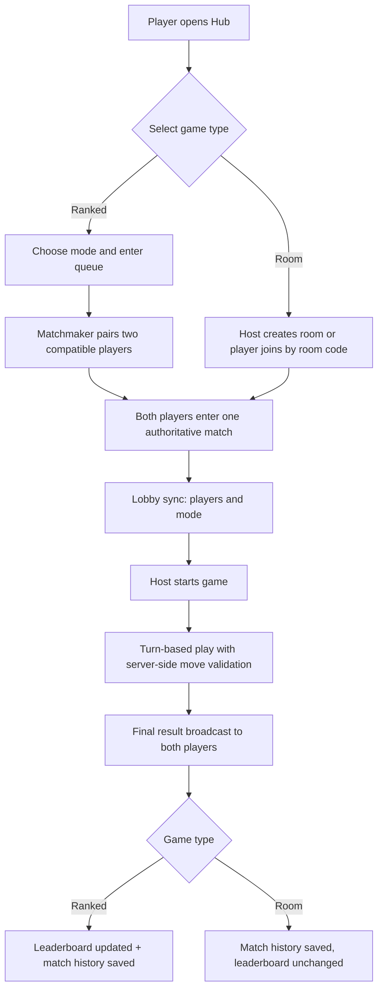
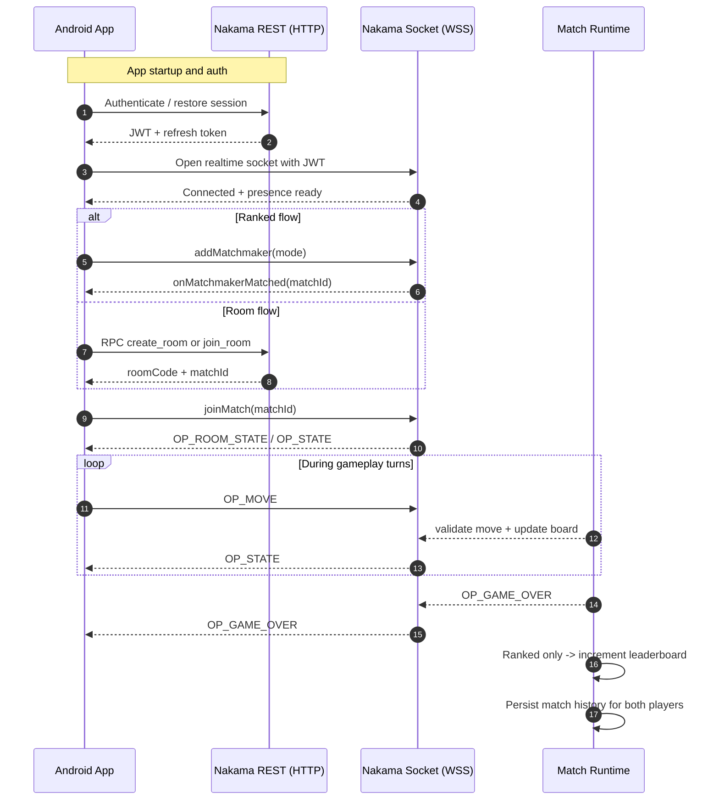

# TicTacToe Multiplayer

## Demo
- Screenshot 1
- Screenshot 2
- Screenshot 3

## Deliverables
- Android app source code repository: [iosahil/TicTacToe](https://github.com/iosahil/TicTacToe)
- Nakama backend source code repository: [iosahil/tictactoe-backend](https://github.com/iosahil/tictactoe-backend)
- Deployed and accessible game mobile application: [TicTacToe-v1.0.0.apk](https://github.com/iosahil/TicTacToe/releases/download/v1.0.0/TicTacToe-v1.0.0.apk)
- Deployed Nakama server endpoint: [tictactoedemo-console.nicemeadow-f4d6a9ec.centralindia.azurecontainerapps.io](https://tictactoedemo-console.nicemeadow-f4d6a9ec.centralindia.azurecontainerapps.io/)

## Project Layout
| Project        | Repository                                         | Purpose                                                 |
|----------------|----------------------------------------------------|---------------------------------------------------------|
| Android app    | [iosahil/TicTacToe](https://github.com/iosahil/TicTacToe) | UI, navigation, auth, realtime gameplay client          |
| Nakama backend | [iosahil/tictactoe-backend](https://github.com/iosahil/tictactoe-backend) | Matchmaking, room flow, game loop, leaderboard, history |

## Setup and Installation
<details>
<summary><strong>Open setup steps</strong></summary>

### 1) Clone repositories (required first step)
```bash
git clone https://github.com/iosahil/tictactoe-backend.git
git clone https://github.com/iosahil/TicTacToe.git
```

### 2) Nakama backend setup
1. In the backend repository root, copy `.env.example` to `.env` & fill it with values.
2. Build backend runtime module:
   ```bash
   cd server
   npm install
   npm run build
   ```

### 3) Android setup (`gradle.properties` is mandatory)
Update the Android project's root `gradle.properties` with these required keys:

```properties
nakama.host=<nakama-api-host>
nakama.port=<nakama-api-port>
nakama.serverKey=<must-match-NAKAMA_SERVER_KEY>
nakama.ssl=<true-or-false>
nakama.socketHost=<nakama-socket-host>
nakama.socketPort=<nakama-socket-port>
nakama.socketSsl=<true-or-false>
nakama.certPin=<sha256/certificate-pin>
google.webClientId=<google-oauth-web-client-id>
```

Then build the Android app:

```bash
cd TicTacToe
./gradlew.bat :app:assembleDebug
```

</details>

## Architecture and Design
### High-level
- Frontend: MVVM + unidirectional state
- Backend: server-authoritative match logic
- Integration: REST for auth/RPC + WebSocket for realtime match events

### User flow


### Network calls


## Decisions Taken
- Server authoritative board/turn/winner: prevents client-side cheating
- Ranked and room use same match loop
- Leaderboard update only on ranked games
- Match history for both players on game end
- Host-only controls in room (start + mode update)
- Host-return timeout in room flow to auto-clean stale rooms
- Session restore + refresh fallback in app
- Connection probe status exposed to UI for clear offline handling
- Production traffic is HTTPS/WSS only, with certificate pinning on Nakama hosts and cleartext blocked for production domains

## Deployment Process Documentation
### Initial deployment
Use the main deploy script from the `deploy` folder.

Recommended flow (reads required values from `.env`):
- `cd deploy`
- `./deploy.ps1`

Or pass explicit parameters:
- `./deploy.ps1 -ResourceGroup <rg> -Location <region> -ContainerApp <app> -ContainerAppEnv <env> -AcrName <acr> -AcrLoginServer <acr>.azurecr.io -DbAddress "<user>:<pass>@<host>:5432/nakama?sslmode=require" -NakamaServerKey "<key>"`

### Refresh existing deployment
Use refresh script for update-only flow:
- `./refresh.ps1 -ResourceGroup <rg> -ContainerApp <app> -AcrName <acr> -AcrLoginServer <acr>.azurecr.io`

### Nakama runtime config
- File: `nakama-config.yml`
- JS entrypoint: `build/main.js`
- Server key: `socket.server_key`
- Matchmaker tuning: interval/max intervals/max tickets

## How to Test Multiplayer Functionality
### Prerequisites
- Two logged-in devices

### Ranked test
1. Start ranked queue with same mode
2. Confirm transition: `Hub -> Matchmaking -> Game`
3. Play match
4. Confirm leaderboard increments
5. Check match history updates for both users

### Room test
1. Host creates room
2. Guest joins using room code
3. Host changes mode and starts match
4. Play full match
5. Return to room lobby
6. Host leaves room and verify room closes for guest
7. Check no ranked leaderboard increment from room game


## NOTE
I initially integrated with the official Nakama Java SDK (`nakama-java`).
During implementation, SDK-level integration issues were slowing delivery, so I switched to a direct REST + WebSocket client approach.
That change gave predictable control over auth, RPC calls, and realtime op-code handling while keeping the backend fully server-authoritative.